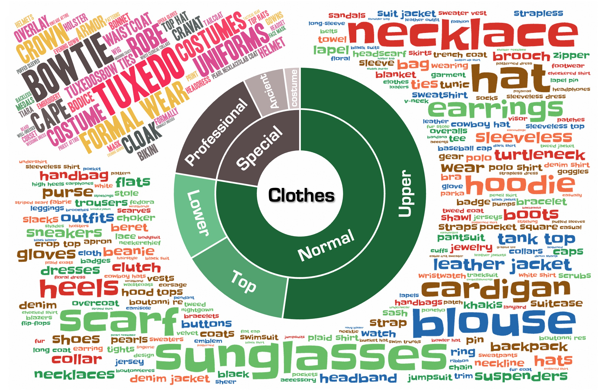
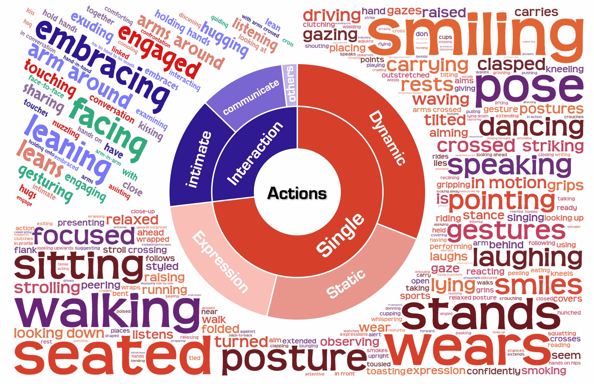

# MultiID-2M
> [](https://arxiv.org/abs/)
[](https://doby-xu.github.io/WithAnyone/)
[](https://huggingface.co/WithAnyone/WithAnyone)
[](https://huggingface.co/datasets/WithAnyone/MultiID-Bench)
[](https://huggingface.co/datasets/WithAnyone/MultiID-2M)


<p align="center"> </p>


## Download

Currently, 1M images and their metadata are available for download.

[HuggingFace Dataset](https://huggingface.co/datasets/WithAnyone/MultiID-2M)

## File Structure
```
MultiID-2M/
├── ref/
│   ├── cluster_centers.tar
│   └── tars/                  # reference tars
│       ├── ...
│
├── train_rec/                 # reconstruction training data
│   ├── re_000000.tar
│   ├── re_000001.tar
│   └── ...
│
└── train_cp/                  # identifiable paired data
    ├── re_000000.tar
    ├── re_000001.tar
    └── ...
```

- `ref/cluster_centers.tar`: Contains the cluster centers of all the identifiable identities in the dataset.
- `ref/tars`: Contains the reference images for each identifiable identity.
- `train_cp`: Contains the training images only of the identifiable identities.
- `train_rec`: Contains the training images of both identifiable and unidentifiable identities.

<!-- ## Labels and Captions -->
## Labels
The dataset contains dense labels for each image, including:
- `url`: The original URL of the original image.
- `ram_score`: Scores from recognize anything model.
- `bboxes`: Bounding boxes of detected faces.
- `aesthetics_score`: Aesthetic score of the image.
- `caption_en`: English caption generated by VLMs.
- `name`: ID number of the identifiable identity (if identifiable, otherwise `none`).
- `embeddings` (or `embedding`): Face embeddings extracted using ArcFace antelopev2 model. This corresponds to the bboxes.

## How to Use

Minimal example coming soon.

You can load the tars directly using `webdataset`.


## Statistics
<p align="center"> </p>


## License and Disclaimer

This dataset is provided for non-commercial academic research purposes only. By accessing or using this dataset you agree to the terms in the [LICENSE](./LICENSE.md).

- **No ownership claim**: The project does not claim ownership of the original images, metadata, or other content included in this dataset. Copyright and other rights remain with the original rights holders.  
- **User responsibility**: Users are responsible for ensuring their use of the dataset complies with all applicable laws, regulations, and third‑party terms (including platform policies).  
- **Takedown / correction requests**: If a rights holder believes content in this dataset infringes their rights, please submit a removal or correction request via the [HuggingFace dataset page](https://huggingface.co/datasets/WithAnyone/MultiID-2M) or the [project page](https://doby-xu.github.io/WithAnyone/), including sufficient proof of ownership and specific identifiers/URLs. After verification of a valid claim, we will remove or correct the affected items as soon as reasonably practicable.  
- **No warranty; limitation of liability**: The dataset is provided "as is" without warranties of any kind. The project and maintainers disclaim liability for any direct, indirect, incidental, or consequential damages arising from use of the dataset.  
- **Prohibited commercial use**: Commercial use is prohibited unless you obtain separate permission from the dataset maintainers; unauthorized commercial use may result in legal liability.  
- **Contact**: Use the HuggingFace dataset page or the project website to submit requests or questions.
